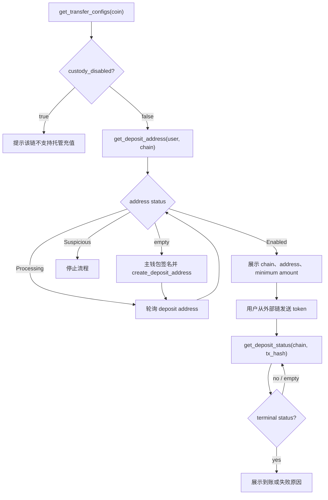
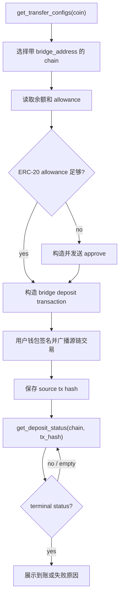
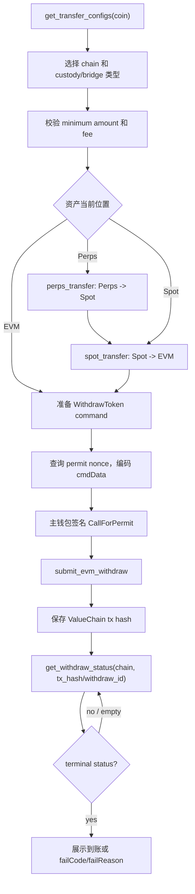

# Sodex Python SDK：Kadima User Flows 实施方案

> 状态：已按审核结论实现于 `feat/python-sdk-user-flows`
> 更新日期：2026-07-31
> 目标仓库：`sodex-python-sdk`
> 当前接口基线：`sodex-gateway/main@6258965`（Gateway `v1.6.15`）
> Python SDK 基线：`sodex-python-sdk/main@bd63fcf`
> 参考实现：`sodex-ts-sdk/main@d1dbba7`、`hyperliquid-python-sdk`

> Gateway `v1.6.15` 已用 chain-only 请求替代下文最初设计的充值地址
> EIP-712 payload，并增加批量 v1、partner v2、user status 和 RWA 日历。
> 本文保留原始方案作为决策记录；当前公开调用方式以 README 和源码为准。

## 实施结果（2026-07-28）

- 已实现资产/链配置、托管充值地址、充值/提现历史与状态查询。
- 已对齐最新 chain-only v1、批量 v1 和 partner-quota v2 充值地址创建，以及 API Key 的生成、聚合注册/查询/撤销。
- 已让 Spot/Perps transfer 返回 Gateway 的 transfer ID，并补齐账户订单/成交 WS 真实 wire shape 与示例。
- 已按照 Lark 文档和 ValueChain 已验证合约实现 `WithdrawToken` ABI 编码、keyed nonce、`hashCallForPermit`、签名与 Gateway 提交。
- 已明确区分托管与桥路线：`custodyDisabled == false` 表示托管可用，`bridgeAddress` 非空表示桥可用。
- Lark 文档没有给出外部源链 bridge deposit 函数 ABI；因此 SDK 本轮只暴露桥地址/可用性和 bridge withdrawal，不伪造 bridge deposit calldata。
- 已把实施范围提升为严格的 Hyperliquid capability audit；完整矩阵见 [`hyperliquid-capability-matrix.md`](hyperliquid-capability-matrix.md)。
- 已补齐自动账户/symbol/coin 解析、`approve_agent()`、builder、TWAP、collateral、subaccount transfer、typed account WS 等所有当前 Gateway 可表达的核心等价能力。
- 完整离线测试为 92 passed；主网 REST/公共 WS/账户 WS、真实 ValueChain permit 构造（不提交）以及全新 Python 3.9 wheel 安装均已通过。

## 1. 目标

本次同时追求两层目标：完整覆盖 Kadima 提出的三条核心 user flow；并严格审计 Hyperliquid Python SDK 的全部公开能力。当前 Gateway 有等价语义的能力必须在 Python SDK 中落地；Gateway 不具备的能力必须明确标为后端阻塞或协议不适用，不能用空 wrapper 假装完成。

1. 从链外充值到 Sodex，包括托管充值和跨链桥充值，并能查询到账状态。
2. 将 Spot / Perps 资产转到 EVM，发起链外提现，并能查询提现状态。
3. 使用主钱包私钥或 API Key 签名交易，下单后拿到 order ID，并通过 WebSocket 接收订单与成交明细。

实施原则：

- 最新 Gateway `main` 是 REST 请求、响应和签名规则的事实来源。
- TS SDK 只作为交易、签名、类型和 WebSocket 的参考，不作为充值/提现接口事实来源。
- 不在 SDK 中维护静态 token、chain、fee 或 minimum amount 列表，始终读取 `/api/v1/asset/config`。
- 金额在 REST model 中保留为字符串，避免 `float` 精度损失；需要计算时由调用方显式转换成 `Decimal`。
- API Key 只用于交易和撤单；创建 API Key、资金划转、充值地址创建和提现必须由主钱包授权。
- 不把多步资金操作隐藏成一个不可观察的大事务。SDK 提供清晰的 primitive 和可复制的 example，由调用方明确控制每一步。

## 2. 当前基线

### 2.1 已有能力

当前 Python SDK 已经具备：

- Spot / Perps 市场数据查询。
- Spot / Perps 下单、撤单、改单、批量操作。
- EIP-712 engine action 签名。
- `spot_transfer()` 和 `perps_transfer()` 内部资产转移。
- 下单返回 `PlaceOrderResult.order_id`。
- 通用 WebSocket 连接、自动重连和重新订阅。
- `accountOrderUpdate`、`accountTrade` channel 常量及基础解析 model。
- `Config.private_key + Config.api_key_name` 形式的 API Key 交易签名能力。

当前测试基线为 53 个测试通过。测试结束时存在 WebSocket fake server 的 asyncio pending-task warning，但不影响当前测试退出码；它不是本方案的功能阻塞项。

### 2.2 关键缺口

| Kadima 要求 | 当前状态 | 缺口 |
| --- | --- | --- |
| 查询支持充值/提现的 token 和 chain | 不支持 | 缺 `/asset/config` wrapper 和 typed model |
| 区分托管与跨链桥充值 | 不支持 | 缺能力判断、桥交易构造和示例 |
| 查询/创建用户充值地址 | 不支持 | 缺 REST wrapper 和 `CreateDepositAddress` EIP-712 签名 |
| 根据充值 tx hash 查询状态 | 不支持 | 缺 `/user/deposit/status` wrapper |
| 查询充值/提现历史 | 不支持 | 缺 history filter 和分页 model |
| Spot / Perps 资产转到 EVM | 部分支持 | 有底层 transfer，但不返回 transfer ID，也没有安全的分步 example |
| 发起链外提现 | 不支持 | 缺 WithdrawToken ABI 编码、permit nonce、签名和 Gateway submit |
| 根据 withdraw ID / tx hash 查询状态 | 不支持 | 缺 `/user/withdraw/status` wrapper |
| 创建、查询、撤销 API Key | 不支持 | 只能使用已存在的 key，不能完成 lifecycle |
| 用 API Key 下单 | 底层支持 | 配置语义不清晰，缺主账户地址字段和端到端 example |
| 下单返回 order ID | 已支持 | 需要增加回归测试和 example 断言 |
| WS 接收订单、成交明细 | 部分支持 | 有低层 channel/model，缺账户级 example 和完整 typed convenience API |

### 2.3 与 TS SDK / Hyperliquid SDK 的关系

- TS SDK 的交易方法、API Key 签名、严格类型、golden vectors 和账户 WS 设计明显领先于当前 Python SDK，适合作为实现参考。
- TS SDK 同样没有最新 Gateway 的链外充值、提现状态、充值地址和 gas-sponsored withdrawal 流程，不能直接照搬这一部分。
- Hyperliquid 的 `approve_agent()`、`withdraw_from_bridge()` 和账户 WS examples 说明，一个对外 Python SDK 应该提供完整 user flow，而不只是裸 HTTP 封装。
- Sodex 的托管充值、跨链桥和 ValueChain permit 模型与 Hyperliquid 不同，只借鉴 SDK 使用体验，不复用其协议细节。

## 3. 目标公开 API

本轮建议继续沿用当前单一 `sodex.client.Client`，避免再引入一套并行 Client。新增的响应对象仍采用 dataclass，并从 `sodex.client` 对外导出。

以下名称是审核用提案，确认后再冻结。

### 3.1 资产配置

```python
configs = client.get_transfer_configs()
usdc = client.get_transfer_configs(coin="USDC")
```

建议返回：

```python
@dataclass
class CoinTransferConfig:
    asset_id: Optional[int]       # Gateway `id`，可能不存在
    asset_name: str               # Gateway `name`，可能为空
    coin: str
    token_address: str            # ValueChain token address
    decimals: int
    chains: list[ChainTransferConfig]

@dataclass
class ChainTransferConfig:
    chain: str
    coin_address: str             # 外部链 token/native coin address
    bridge_address: str
    custody_withdraw_fee: str
    bridge_withdraw_fee: str
    min_deposit_amount: str
    min_withdraw_amount: str
    custody_disabled: bool
```

能力判断不能只看 coin 名称：

- 托管：`custody_disabled == False`。
- 跨链桥：需要有可用 `bridge_address`，并且桥 ABI 明确支持该 token/chain。
- `asset_id` / `asset_name` 是可选字段；不存在时不能假造 `0`。
- `VALUECHAIN` 也可能出现在 chains 中，调用方必须使用 Gateway 返回的原始 chain identifier。

### 3.2 托管充值地址

```python
address = client.get_deposit_address(
    user_address="0x...",
    chain="TON",
)

address = client.create_deposit_address(
    user_address="0x...",  # 必须与配置的主钱包 signer 一致
    chain="TON",
    deadline=None,         # 默认当前时间 + 合理窗口，单位秒
    nonce=None,            # 默认由 SDK 生成非零 uint64
)
```

返回：

```python
@dataclass
class UserDepositAddress:
    chain: str
    address: str
    status: str  # Processing | Enabled | Suspicious | future values
```

`create_deposit_address()` 必须由 SDK 完成以下签名，不要求用户手工拼 digest：

```text
Domain:
  name              = universal
  version           = 1
  chainId           = Sodex chain ID
  verifyingContract = 0x0101010101010101010101010101010101010101

Primary type:
  CreateDepositAddress(uint64 nonce,uint64 deadline,string chain)
```

状态处理规则：

- `Enabled`：地址可用。
- `Processing`：继续轮询查询接口。
- 空 address/status：调用创建接口。
- `Suspicious`：停止流程，不把地址展示为可充值地址。
- Gateway 当前只在 mainnet 注册 deposit-address routes；SDK 文档和 example 必须明确这一点。

### 3.3 充值/提现历史与状态

```python
history = client.get_deposit_withdrawals(
    user_address="0x...",
    filter=DepositWithdrawalFilter(
        side="deposit",
        chain="BASE_ETH",
        pending=True,
        start=0,
        limit=10,
    ),
)

status = client.get_deposit_status(
    chain="BASE_ETH",
    tx_hash="0x...",
)

status = client.get_withdraw_status(
    chain="BASE_ETH",
    withdraw_id="withdraw-request-abc",
)

status = client.get_withdraw_status(
    chain="BASE_ETH",
    tx_hash="0x...",
)
```

需要新增：

```python
@dataclass
class DepositWithdrawalFilter:
    start: int = 0
    start_time: Optional[int] = None
    end_time: Optional[int] = None
    limit: Optional[int] = None
    side: Optional[str] = None
    token: Optional[str] = None
    pending: Optional[bool] = None
    chain: Optional[str] = None
    coin_symbol: Optional[str] = None

@dataclass
class DepositWithdrawalRecord:
    account: str
    amount: str
    chain: str
    coin: str
    decimals: int
    fail_code: str
    fail_reason: str
    sequence: str            # wire field `n`
    receiver: str
    report_amount: str
    sender: str
    status: str
    status_time: int
    timestamp: int           # wire field `stmp`
    token: str
    tx_hash: str
    origin_tx_hash: Optional[str]
    type: str
    withdraw_fee: Optional[str]
    withdraw_id: Optional[int]

@dataclass
class DepositWithdrawalHistory:
    records: list[DepositWithdrawalRecord]
    total: int
```

注意：

- Deposit status 的唯一查询条件是 `chain + txHash`。
- Withdraw status 接受 `chain + withdrawId` 或 `chain + txHash`。
- Gateway 查询层允许 withdraw ID 为 opaque string；即使响应 record 目前是可选 uint64，请求 model 也不能只接受 `int`。
- 如果同时提供 withdraw ID 和 tx hash，行为与 Gateway 保持一致：withdraw ID 优先。
- status API 返回的是 `DepositWithdrawalHistory`，一次查询可能匹配多条记录，不能简化成单个 record。
- 空 records 表示“尚未索引或没有匹配项”，不等于已经完成。

### 3.4 API Key 生命周期

```python
generated = generate_api_key(name="my-bot")

client.add_api_key(
    user_address=client.address,
    request=AddAPIKeyRequest(
        account_id=1001,
        name=generated.name,
        public_key=generated.address,
        expires_at=0,
        permissions=APIKeyPermission.TRADE | APIKeyPermission.CANCEL,
    ),
)

keys = client.get_api_keys(user_address=client.address, name="my-bot")

client.revoke_api_key(
    user_address=client.address,
    account_id=1001,
    name="my-bot",
)
```

生成结果：

```python
@dataclass
class GeneratedAPIKey:
    name: str
    address: str
    private_key: bytes  # 只在本地返回，SDK 不落盘、不打印
```

需要实现：

- 使用 `secrets` 生成 32-byte secp256k1 private key。
- public key 按 Gateway 现状传 EVM address，而不是未压缩 EC public-key bytes。
- `AddAPIKey` 使用 `universal` domain 和独立的 EIP-712 struct：

```text
AddAPIKey(
  uint64 accountID,
  string name,
  uint8 keyType,
  bytes publicKey,
  uint64 expiresAt,
  uint64 nonce
)
```

- wire signature type 为 `0x02`，不能复用普通交易的 `0x01`。
- 调用 Gateway 聚合接口 `/api/v1/user/{userAddress}/api-keys`，一次写入 Spot 和 Perps。
- query 返回 `{spot: [...], perps: [...]}`，不能合并后丢失 engine 差异。
- revoke 使用 Gateway 聚合接口，同时撤销两个 engine 的同名 key。
- `permissions` 使用显式 `IntFlag`：trade bit `1 << 0`，cancel bit `1 << 1`。
- `GeneratedAPIKey.private_key` 只返回一次；examples 只演示写入环境变量/secret manager，不把 key 打印到 stdout。

为了区分“签名地址”和“主账户地址”，建议给 `Config` 增加：

```python
account_address: Optional[str] = None
```

兼容规则：

- `Client.address` 继续返回当前 private key 对应的 signer address，避免破坏现有代码。
- 使用 API Key 时，`Config.private_key` 是 API Key 私钥，`Config.api_key_name` 是注册名称，`Config.account_address` 是主钱包地址。
- 交易请求继续由 API Key 私钥签名；账户查询和 WS 订阅使用主钱包地址。
- 不在 SDK 中自动持久化 API Key secret。

### 3.5 交易与账户 WebSocket

现有下单返回值已经包含 `order_id`，本轮不重写交易 API。需要补齐：

- 主钱包签名下单 example。
- API Key 生成、注册、构造新 Client、下单的端到端 example。
- example 必须检查 `PlaceOrderResult.order_id`，而不是只打印原始响应。
- 账户 WS example 同时订阅：
  - `accountState`
  - `accountOrderUpdate`
  - `accountTrade`
- 使用 `order_id` / `cl_ord_id` 关联 REST 下单响应、订单更新和成交明细。
- 给 `AccountOrderUpdate`、`AccountTrade` 增加覆盖真实 wire shape 的解析测试。

建议增加一个不破坏底层 `subscribe()` 的 convenience API：

```python
subscription = ws.subscribe_account(
    user=user_address,
    symbols=["BTC-USD"],
    on_snapshot=...,
    on_order_update=...,
    on_trade=...,
)
subscription.close()
```

如果第一阶段要严格控制改动量，也可以先交付底层订阅 example，把 `subscribe_account()` 放到第二阶段；Kadima 的“WS 收到交易明细”验收不依赖这个 convenience wrapper。

## 4. 充值 user flow

### 4.1 托管充值



SDK 交付边界：

- SDK 查询和创建充值地址、签名、查询状态。
- SDK 不托管用户的外部链资产。
- custody example 输出必要充值信息，外部链转账由用户钱包执行。
- 如果链需要 memo/tag，而 Gateway response 尚未提供，SDK 不能猜测；需要 Gateway/Mirror 先补充字段。

### 4.2 跨链桥充值



这里不能把 TS SDK 的 `ClobGateway.depositErc20()` 当作外部跨链桥充值。该方法是 ValueChain ClobGateway 入金，不等价于外部链 bridge flow。

建议 API 分为两层：

```python
prepared = client.prepare_bridge_deposit(...)
# prepared.to / prepared.data / prepared.value / prepared.chain_id

tx_hash = broadcaster.send(prepared)
```

默认由 SDK 构造交易，调用方的钱包/RPC adapter 负责签名和广播。这样可以支持私钥、硬件钱包和托管钱包，而不强制 SDK 接管外部链私钥。

完整实现前必须确认第 8 节中的 bridge ABI 和 per-chain RPC 信息。仅返回 `bridge_address` 不能算完成跨链桥充值功能。

## 5. 提现 user flow



### 5.1 内部资金转移

现有方法可以复用，但要修正返回值：

```python
receipt = client.perps_transfer(request)
receipt = client.spot_transfer(request)

@dataclass
class TransferReceipt:
    id: int
```

Gateway 已经返回 `{id}`，当前 Python SDK 丢弃了它。后续状态排查和幂等控制需要保留这个 ID。

建议 examples 明确使用以下步骤，不新增会隐式连续发两笔交易的 `move_all_to_evm()`：

- Perps → Spot：Perps `SPOT_WITHDRAW`。
- Spot → EVM：Spot `EVM_WITHDRAW`。
- transfer request ID 由 SDK helper 生成严格单调的 uint64，但仍允许高级用户显式传入以实现幂等。

具体 account ID 和 treasury account `999` 的封装方式需要和 Gateway/账户模型再确认，不能在不了解账户关系时自动猜测来源 account ID。

### 5.2 EVM withdrawal permit

建议同时提供低层和高层入口：

```python
prepared = client.prepare_evm_withdraw(
    coin="USDC",
    chain="BASE_ETH",
    receiver="0x...",
    amount=Decimal("100"),
    withdrawal_type="custody",
    deadline=None,
)

submission = client.submit_evm_withdraw(
    user_address="0x...",
    request=prepared,
)
```

低层 request/response：

```python
@dataclass
class EVMWithdrawRequest:
    cmd_data: str
    nonce: str
    deadline: str
    signature: str

@dataclass
class EVMWithdrawSubmission:
    tx_hash: str
    sender_address: str
    sender_nonce: int
```

`prepare_evm_withdraw()` 负责：

1. 根据 Gateway asset config 选择 token、chain、fee 和 minimum amount。
2. ABI 编码 `WithdrawToken` command data。
3. 从 ValueChain 合约读取 permit nonce。
4. 生成 deadline。
5. 计算 `hashCallForPermit(to, "WithdrawToken", cmdData, nonce, deadline)`。
6. 用主钱包签名。

`submit_evm_withdraw()` 只向 Gateway 发送：

- `cmdData`
- `nonce`
- `deadline`
- `signature`

不得让调用方传 `to` 和 `cmdType`；Gateway 会固定为 WithdrawToken target 和 command。

Gateway 返回的 `tx_hash` 只表示 TxProxy 已提交 ValueChain 交易，不表示外部链提现完成，必须继续调用 withdraw status/history。

## 6. 代码改动范围

以下是建议结构，最终实现尽量沿用现有文件，不为每个 model 单独建文件。

### 6.1 HTTP 与 models

- `sodex/client/client.py`
  - 增加普通 JSON `POST` helper。
  - 增加 asset、deposit address、history/status、API Key、EVM withdrawal 方法。
  - 让 `spot_transfer()` / `perps_transfer()` 返回 `TransferReceipt`。
- `sodex/client/types.py`
  - 增加本方案列出的 Gateway response dataclasses。
  - 增加 `from_dict()` 映射，保持 wire camelCase 到 Python snake_case。
- `sodex/client/__init__.py`
  - 导出新增公开类型。

### 6.2 签名

- `sodex/common/enums.py`
  - 增加 AddAPIKey signature type `0x02`。
  - 增加 API Key type/permission。
- `sodex/common/types.py`
  - 允许 EIP-712 domain 使用非零 verifying contract，同时保持现有 engine domain 默认零地址。
  - 增加 Add/Revoke API Key request 和必要的 typed structs。
- `sodex/common/signer.py`
  - 增加 raw digest 签名 primitive。
  - 增加 CreateDepositAddress 签名。
  - 增加 AddAPIKey 独立签名。
  - 在 ABI 确认后增加 CallForPermit 签名。

签名改动必须使用 Gateway/Go/TS 的 golden vector 验证，不能只做“sign/recover 自洽”测试。

### 6.3 EVM / bridge

只有在 ABI 和 RPC 约定确认后才增加 `sodex/evm`：

- ABI encoding。
- ERC-20 allowance / approve transaction preparation。
- bridge deposit transaction preparation。
- ValueChain permit nonce query。
- WithdrawToken cmdData preparation。

建议把 `web3` 做成可选 extra，避免只使用交易 REST/WS 的用户被迫安装完整 EVM stack。核心签名继续使用已有 `eth-account` / `eth-keys` 依赖。

### 6.4 WebSocket

- 第一阶段保留 `sodex/ws/client.py` 的低层订阅 API。
- 增加账户 WS end-to-end example 和 parser tests。
- 审核通过后决定是否同一分支增加 TS 风格的 `subscribe_account()` convenience API。

## 7. 分阶段实施顺序

### Phase 0：冻结协议输入（阻塞 bridge/withdraw high-level API）

复杂度：小；优先级：P0。

- 确认 bridge deposit ABI、native/ERC-20 分支、approve 规则。
- 确认 WithdrawToken cmdData 的准确 ABI tuple 和 withdrawal type 编码。
- 确认 permit nonce 的合约、方法和 RPC endpoint。
- 确认 mainnet/testnet contract address 与 chain ID。
- 产出跨 Go/TS/Python 共用 golden vectors。

### Phase 1：Gateway funding query + 托管充值

复杂度：中；优先级：P0；不依赖 bridge ABI。

- Asset config models 和 client method。
- Deposit address GET/POST。
- CreateDepositAddress EIP-712 signing。
- Deposit/withdraw history 和分页。
- Deposit/withdraw status。
- Custody deposit example。
- 全部 HTTP 和 signing 单测。

完成后可独立交付 Kadima 的托管充值、支持资产查询和状态查询。

### Phase 2：API Key lifecycle + 交易闭环

复杂度：中；优先级：P0。

- API Key 生成、AddAPIKey 签名、聚合 add/get/revoke。
- `Config.account_address`。
- 主钱包/API Key 两套下单 example。
- order ID 与账户 WS order/trade correlation example。
- API Key golden vectors 和 HTTP tests。

### Phase 3：内部转移 + EVM 提现

复杂度：大；优先级：P0；依赖 Phase 0 的 WithdrawToken 信息。

- 修复 transfer receipt 丢失。
- Perps → Spot → EVM example。
- WithdrawToken cmdData、permit nonce、deadline 和签名。
- gas-sponsored withdraw submit。
- withdraw status polling example。
- ABI/signature golden vectors 和 mocked RPC tests。

### Phase 4：跨链桥充值

复杂度：大；优先级：P1；依赖 Phase 0 的 bridge 信息。

- ERC-20 approve transaction preparation。
- native/ERC-20 bridge deposit transaction preparation。
- user-provided wallet/RPC broadcaster adapter。
- source tx hash → deposit status polling。
- bridge deposit example 和 mocked RPC tests。

### Phase 5：发布质量

复杂度：中；优先级：P0。

- README 增加五个完整 user flows。
- 增加或更新 examples：
  - `custody_deposit.py`
  - `bridge_deposit.py`
  - `withdraw.py`
  - `api_key_trade.py`
  - `account_websocket.py`
- CI 覆盖 Python 3.9 及当前稳定版本。
- 建包和安装 smoke test。
- mainnet/testnet live tests 通过环境变量显式开启，默认不花费资金。
- 确认版本升级策略；新增公开能力建议至少升级 minor version。

## 8. 实现前需要确认的外部输入

以下内容不能从当前 Gateway REST handler 或公开 TS SDK 唯一推出。未确认前可以完成 Phase 1/2，但不能声称完整完成 bridge/withdraw flow。

1. **Bridge deposit ABI**
   - bridge contract 的准确 ABI。
   - ERC-20 与 native token 的方法、参数和 payable 规则。
   - `bridgeAddress` 是否就是用户应调用的最终 contract。
   - 是否需要 memo、destination account 或额外 proof。

2. **WithdrawToken command ABI**
   - `cmdData` 的准确参数顺序和类型。
   - custody/bridge withdrawal type 的编码。
   - amount 使用 token base units 还是 decimal string。
   - receiver 对非 EVM chain 的编码形式。

3. **Permit nonce 与 hash**
   - nonce 从哪个合约、哪个 view method 获取。
   - `hashCallForPermit` 是 EIP-712 typed data、EIP-191 还是直接 digest 签名。
   - signature 的 `v` 使用 `0/1` 还是 `27/28`。
   - deadline 单位和允许窗口。

4. **Network configuration**
   - ValueChain mainnet/testnet RPC。
   - bridge contracts 的 per-chain address 与 chain ID。
   - Gateway deposit-address 未来是否开放 testnet。

5. **状态枚举**
   - Mirror deposit/withdraw 的完整 terminal/pending/failure status 列表。
   - 在列表未稳定前，SDK 应保留原始 status string，不对未知值报错。

6. **账户与 transfer 路径**
   - Perps → Spot → EVM 是否始终使用同一个 account ID。
   - treasury account ID `999` 是否是长期公开协议常量。
   - `asset/config.id` 是否可以直接用于所有 Spot → EVM transfer。

## 9. 测试计划

### 9.1 Unit tests

- Asset config 全字段、可选 `id/name`、空列表和 coin filter。
- Deposit address empty/Processing/Enabled/Suspicious 响应。
- CreateDepositAddress digest、签名恢复、chain/deadline/nonce sensitivity。
- History query 参数映射、`pending=False` 不被丢弃、limit/start 边界。
- Deposit status 返回 0/1/多条 records。
- Withdraw status 的 ID、opaque ID、tx hash 和 ID precedence。
- AddAPIKey golden vector、signature type `0x02`、聚合 route 和 headers。
- API Key list 的 spot/perps 分离映射。
- Revoke API Key route 和普通 action 签名。
- Transfer receipt ID 映射。
- Withdraw cmdData/permit golden vector（ABI 确认后）。
- WebSocket account order/trade 解析和 reconnect 后重订阅。

按照仓库约定，每个新增/修改的 test function 前必须有一句短注释，说明验证目标和覆盖的主要路径/边界。

### 9.2 Integration tests

- 默认只跑 mock HTTP / mock RPC，不能访问真实资金。
- `SODEX_LIVE=1` 时允许只读验证：server time、asset config、market data。
- Deposit address、API Key 注册、内部转移、bridge 和 withdraw 必须再增加更明确的环境开关，且 CI 默认关闭。
- 真实资金测试使用专用小额测试账户，不复用开发者主钱包。

### 9.3 Cross-SDK vectors

至少共享以下 fixtures：

- 普通 spot/perps ExchangeAction。
- AddAPIKey。
- CreateDepositAddress。
- WithdrawToken CallForPermit。
- bridge transaction calldata（ABI 确认后）。

同一输入在 Go、TS、Python 中必须得到相同 digest/signature/calldata；只验证 Python 自己能 recover 自己的签名不够。

## 10. 验收标准

### 10.1 托管充值

- 用户能通过 SDK 查询 token/chain/minimum/custody availability。
- 用户能查询充值地址；不存在时能用主钱包签名创建。
- SDK 正确处理 empty、Processing、Enabled、Suspicious。
- 用户拿到外部链 tx hash 后能查询 0/1/多条充值状态。
- example 不使用硬编码 chain/token 配置。

### 10.2 跨链桥充值

- SDK 根据 asset config 和官方 ABI 构造 approve/bridge transaction。
- 用户钱包能够签名并广播，SDK 返回 source tx hash。
- source tx hash 能用于 Gateway deposit status polling。
- custody 和 bridge 具有不同的公开方法/flow，不能共享一个含义模糊的 `deposit()`。

### 10.3 提现

- SDK 能明确完成 Perps → Spot → EVM 的分步转移，并返回每步 receipt ID。
- SDK 能构造正确 WithdrawToken cmdData、读取 nonce、签名 permit。
- Gateway submit 返回值被建模为 submission，而不是 final withdrawal。
- 用户能使用 withdraw ID 或 tx hash 查询最终进度和失败原因。

### 10.4 交易

- 用户能生成、注册、查询和撤销 API Key。
- 同一交易 example 能分别使用主钱包和 API Key 下单。
- REST 下单返回非零 order ID。
- WS 能用 order ID / client order ID 关联订单更新和成交明细。
- API Key secret 不出现在 SDK log、exception 或 example stdout。

### 10.5 工程质量

- 当前 53 个测试继续通过。
- 新增 REST/signing/WS tests 全部通过。
- 无真实私钥、API Key、RPC secret 或资金地址提交到仓库。
- README、公开 import 和 package build 与实现保持一致。
- worktree 中现有的 kline docstring 本地修改不被覆盖或误提交。

## 11. 建议的分支和提交拆分

审核通过后再创建分支，建议名称：

```text
feat/python-sdk-user-flows
```

建议提交顺序：

1. `feat: add gateway funding models and query APIs`
2. `feat: add custody deposit address signing and APIs`
3. `feat: add aggregate API key lifecycle`
4. `feat: complete account trading websocket example`
5. `feat: add EVM withdrawal preparation and submission`
6. `feat: add bridge deposit transaction preparation`
7. `docs: add end-to-end funding and trading examples`

如果 Phase 0 的外部信息没有及时确认，分支可以先完成并提交 Phase 1/2；bridge 和 high-level withdraw 不应使用猜测 ABI 占位。

## 12. 本次审核需要拍板的事项

1. 是否同意优先级：Phase 1 托管充值 → Phase 2 API Key/交易闭环 → Phase 3 提现 → Phase 4 bridge。
2. bridge 默认是否采用“SDK 构造交易，调用方钱包签名/广播”，而不是 SDK 强制接管外部链私钥。
3. 是否接受新增可选 `web3` extra，保持核心交易 SDK 轻量。
4. 是否在本轮增加 `subscribe_account()` convenience API；若追求最小改动，可先只交付 typed example。
5. `Config.account_address` 是否按本方案新增，用来区分主账户与 API Key signer。
6. 谁提供/确认第 8 节的 bridge ABI、WithdrawToken ABI、permit nonce 和状态枚举。
7. 当前工作区已有的 kline docstring 本地修改是否应与后续功能分支一起保留，还是先单独处理。
